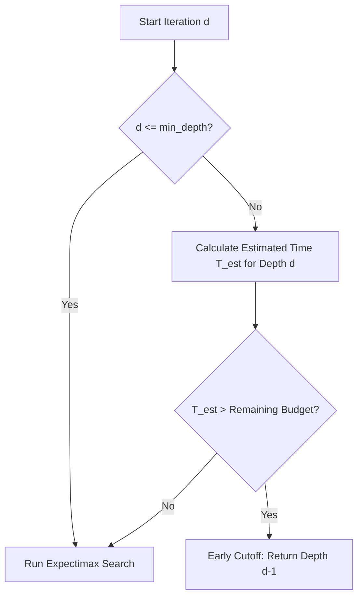

# Proposal: Time-Predictive Iterative Deepening Cutoff

## 1. Context & Motivation

Expectimax search is an exponential search algorithm. Across iterative deepening steps, the search tree size (and consequently, the execution time) grows by a factor of **20× to 50×** per depth step depending on the number of empty cells:

* **Shallow / Sparse Boards** (e.g. 14 empty cells): Branching factor is extremely high because of the combinations of spawn outcomes.
* **Dense / End-game Boards** (e.g. 3 empty cells): Branching factor is small, allowing deep searches within milliseconds.

Currently, the solver blindly begins the next depth level $d$ in the iterative deepening loop. If the time limit is reached mid-search, the entire search for depth $d$ is aborted via `TimeoutError`, and all visited nodes are discarded. This leads to two major inefficiencies:
1. **Wasted CPU Cycles**: The CPU spends substantial time searching a depth that has zero probability of completing before the timeout.
2. **Late Recommendations**: The main GUI/client waits until the full timeout (plus grace period) before displaying the best move from the previous completed depth $d-1$, when it could have returned the move immediately.

---

## 2. Proposed Architecture: Time-Predictive Cutoff

Before starting search iteration $d$, the solver will estimate the execution time $T_d^{\text{est}}$ required to complete depth $d$. If the estimated time exceeds the remaining time budget, the solver **aborts the loop immediately** and returns the results of depth $d-1$ without wasting CPU cycles.



---

## 3. Mathematical Estimation Model

Let:
* $K$ be the number of empty cells on the board.
* $V$ be the number of valid moves available (typically $\le 4$).
* $S(K)$ be the total number of spawn outcomes generated for $K$ empty cells in the active mode.
* $T_{d-1}$ be the time (in ms) taken to complete the search of depth $d-1$.

### Average Ply Branching Factor ($B_{\text{ply}}$)
Since expectimax alternates between player moves (max nodes) and random tile spawns (chance nodes):
* A player node has an average branching factor of $V$.
* A chance node has an average branching factor of $S(K)$.

Thus, a full round (2 plies) has a branching factor of $V \times S(K)$. The average branching factor per single ply $B_{\text{ply}}$ is:
$$B_{\text{ply}} = \sqrt{V \times S(K)}$$

### Next Depth Time Estimation ($T_d^{\text{est}}$)
The time taken to search depth $d$ is proportional to the size of the search tree at depth $d$. We estimate:
$$T_d^{\text{est}} = T_{d-1} \times B_{\text{ply}}$$

If $T_{d-1}$ is extremely small (e.g. $< 1\text{ms}$ at depth 1), we apply a minimum node-rate baseline:
$$T_d^{\text{est}} = \max\left(T_{d-1} \times B_{\text{ply}}, \frac{N_{d-1} \times B_{\text{ply}}}{\text{Baseline Nodes/ms}}\right)$$

---

## 4. Implementation Specification

In [solver.py](file:///data/copilot/workspace/solver2048d/src/solver.py), inside the iterative deepening loop:

```python
# Calculate elapsed time
elapsed = (time.time() - start_time) * 1000
remaining_budget = max_time - elapsed

# Predict next depth time
if d > min_depth and max_time:
    # 1. Calculate number of spawn outcomes S(K)
    empty_count = sum(1 for i in range(16) if ((board >> (i * 4)) & 0xF) == 0)
    # S(K) approximation based on spawn_probabilities config
    spawn_outcomes_count = get_approx_spawn_outcomes_count(empty_count, mode_name, config)
    
    # 2. Get branching factors
    v_moves = len(get_valid_moves(board))
    b_ply = math.sqrt(v_moves * spawn_outcomes_count)
    
    # 3. Predict time for next iteration d
    time_taken_last_depth = elapsed_time_of_depth_d_minus_1
    estimated_next_time = time_taken_last_depth * b_ply
    
    # 4. Cutoff if budget is insufficient
    if estimated_next_time > remaining_budget:
        # Early cutoff: do not start depth d
        break
```

---

## 5. Expected Benefits

1. **CPU Efficiency**: Saves significant CPU/GPU resources on multithreaded/multiprocess runs by terminating futile threads early.
2. **Instant Response**: If the solver knows it cannot finish Depth 5 in the remaining 400ms of a 1s budget, it will return Depth 4 immediately at 600ms instead of waiting for the full 1000ms timeout to trigger.
3. **Batter/Power Optimization**: Crucial for client-side automation running on mobile devices or lower-end capture environments.
